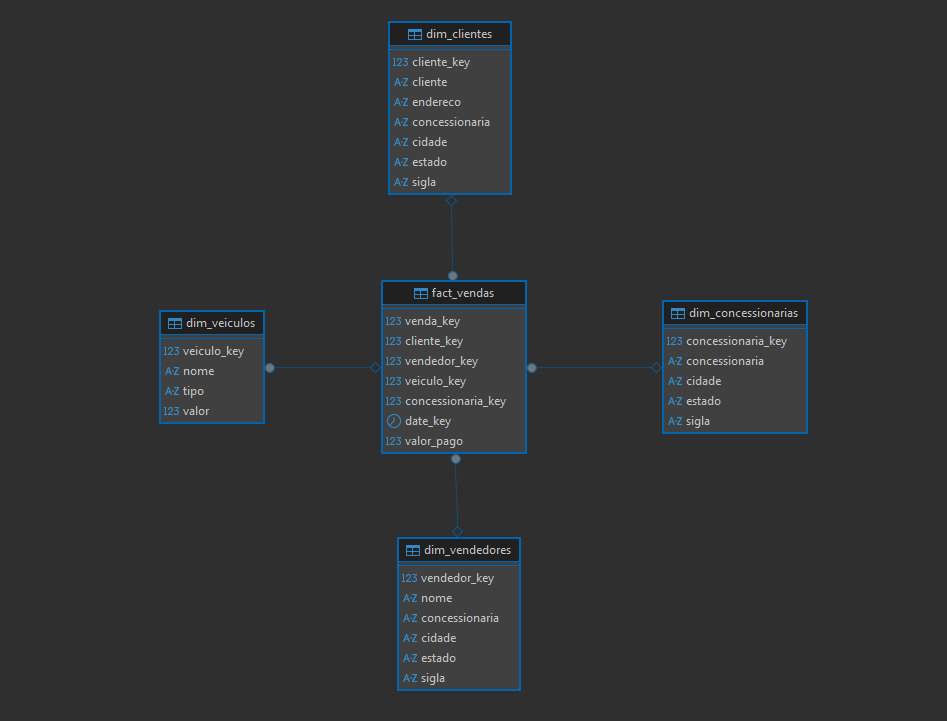

# Ecommerce Data Platform

## 🚗 Projeto Data Platform – Vendas de Concessionária

Este projeto simula uma arquitetura moderna de Engenharia de Dados inspirada no curso:

Bootcamp Engenharia de Dados: **Construa um Projeto Real**

Instrutor: **Fernando Amaral**

A proposta foi reproduzir a arquitetura do curso utilizando ferramentas open-source, adaptando o Data Warehouse para um ambiente local e controlado.

---

## 🎯 Objetivo

Construir uma arquitetura ELT completa que:

- Extraia dados de um banco transacional PostgreSQL
- Carregue para um Data Warehouse
- Transforme os dados com dbt
- Modele um esquema estrela
- Implemente testes de qualidade
- Prepare os dados para consumo analítico (BI)

---

##  🏗️ Arquitetura do Projeto

### 📦 Fonte (OLTP)

- PostgreSQL (base relacional normalizada)
- Modelo altamente normalizado (3FN)

### 🧠 Data Warehouse (OLAP)

- DuckDB como engine analítica
- Camada Staging
- Camada Marts (modelo estrela)

### 🔄 Transformação

- dbt rodando em container Docker
- Modelos organizados em:
    - `staging`
    - `marts`

---

## 🔁 Fluxo ELT

PostgreSQL

- DuckDB (Staging via postgres_scan)
-  dbt transforma
-  Modelo Estrela
-  Consumo BI

Diferente da arquitetura original do curso (que utilizava Airflow + Snowflake), neste projeto:

- A carga foi feita diretamente via `postgres_scan`
- O foco foi simplificar a arquitetura mantendo os conceitos fundamentais

---

## ⭐ Modelo Estrela

A modelagem dimensional foi construída a partir do modelo transacional.

### 🔹 Fato

`fact_vendas`

- venda_key
- cliente_key
- vendedor_key
- veiculo_key
- concessionaria_key
- date_key
- valor_pago

### 🔹 Dimensões

- dim_clientes
- dim_vendedores
- dim_veiculos
- dim_concessionarias

A dimensão de estado não foi criada separadamente, pois as informações geográficas foram incorporadas nas dimensões principais (desnormalização controlada para análise).

---

## 🔐 Variáveis de Ambiente

Credenciais sensíveis são armazenadas em arquivo `.env`, que não é versionado no repositório.

---

## 🧪 Testes Implementados

Foram aplicados testes com dbt:

- `unique`
- `not_null`

Isso garante:

- Integridade das chaves primárias
- Integridade referencial
- Confiabilidade analítica

---

##  🛠️ Stack Utilizada

- PostgreSQL
- DuckDB
- dbt
- Docker
- DBeaver (visualização)

---

## 🧠 Decisões Técnicas

### Por que DuckDB?

- Open-source
- Leve
- Permite leitura federada via `postgres_scan`

### Por que dbt?

- Versionamento de transformações
- Separação clara entre staging e marts
- Testes integrados
- Padrão de mercado para transformação ELT

### Por que simplificar (sem Airflow)?

A arquitetura original utilizava Airflow para orquestração.
Neste projeto, optou-se por focar na modelagem e transformação antes de adicionar complexidade de orquestração.

Airflow pode ser integrado em uma próxima versão do projeto.

---

## 📈 Próximos Passos

- Integração com ferramenta de BI open-source
- Orquestração com Airflow
- Implementação de incremental models
- Criação de documentação automática com `dbt docs`

---

## 📚 Referência

Projeto inspirado no curso:

Bootcamp Engenharia de Dados: Construa um Projeto Real
Instrutor: Fernando Amaral
